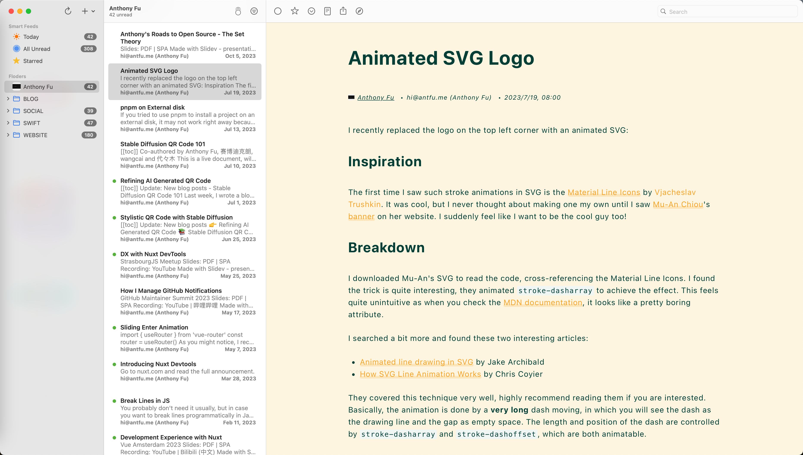

# Pupa Theme for NetNewsWire


## Overview

Pupa is a streamlined theme designed specifically for the [NetNewsWire RSS Reader](https://github.com/Ranchero-Software/NetNewsWire/tree/main) on  MacOS.

## Screenshots




## Installation

Open the following URL in your browser to add the 'Pupa' theme to NetNewsWire.
```
netnewswire://theme/add?url=https://github.com/wxiach/NNWThemePupa/releases/download/v1.0.0/pupa.nnwtheme.zip
```

## License

[MIT License](/LICENSE)


